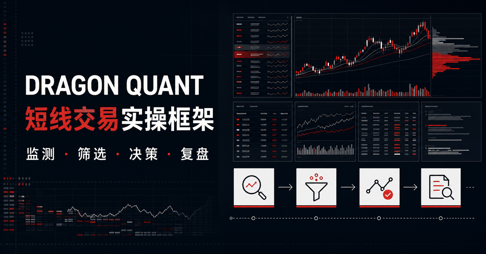
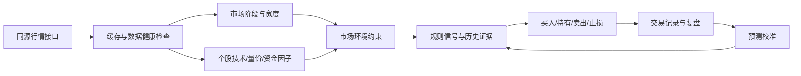

# Dragon Quant｜短线交易实操框架

面向 A 股短线交易者的本地优先决策工作台，将 **市场监测、龙头筛选、技术分析、量化因子、风险控制、交易计划与复盘** 放在同一个界面中。



## 宣传视频

<video controls preload="metadata" poster="https://raw.githubusercontent.com/Jack76/a-share/main/public/og.png" width="100%">
  <source src="https://raw.githubusercontent.com/Jack76/a-share/main/public/dragon-quant-promo.mp4" type="video/mp4">
</video>

[如果 GitHub 页面未直接显示播放器，点击下载 MP4](public/dragon-quant-promo.mp4)

> 这是研究与决策辅助工具，不是自动下单系统。任何信号、预测、止损和仓位建议都不构成投资建议，也不保证收益。

## 项目定位

Dragon Quant 的目标不是给出一个看似精确的“涨跌答案”，而是把短线决策拆成可检查的证据链：

1. 先判断当前市场处于什么环境；
2. 再观察板块、情绪、宽度和资金是否共振；
3. 对候选标的计算技术、量价、微观结构和历史规律因子；
4. 输出买入条件、持有条件、卖出/止损条件以及数据可靠度；
5. 在交易结束后记录执行结果，用于复盘和后续校准。

## 主要功能

### 1. 市场总览与情绪监测

- 市场宽度：上涨/下跌家数、涨跌停、平均涨跌幅、成交量等；
- 指数与市场温度：区分趋势、震荡、高潮、退潮等阶段；
- 情绪温度计、连板高度和大面风险监测；
- 板块共振与风险传染，用于识别“个股强但市场不配合”的场景；
- 事件驱动模式提示，辅助识别地缘、政策和商品脉冲带来的结构变化。

### 2. 龙头核心池

- 按角色、状态、信号、题材和关键词筛选标的；
- 支持自选、持仓、观察和已离场状态；
- 表格与移动端卡片两种视图；
- 标的名称可直接进入详情诊断；
- 行情、涨跌、趋势走势、空间/换手、品质与风险集中展示；
- 自动发现与规则扫描，帮助补充观察池，而不是替代人工确认。

### 3. 个股详情与证据链

- 日线历史趋势与技术指标；
- MA、MACD、布林带、量能结构、换手和筹码相关信号；
- 大单净额与微观结构方向校验；
- 市场覆盖、个股数据完整度和证据样本单独标记；
- 同时给出买入触发、持有条件、止盈、止损和卖出触发，避免只讨论“买不买”。

### 4. 量化与历史规律

- A 股交易规则因子：涨跌停、T+1、交易时段、板块差异等；
- 趋势、动量、波动、量价、换手、资金流和市场宽度因子；
- 历史滚动证据与非重叠样本，降低把同一段行情重复计入的风险；
- 预测校准、预测台账和策略指标，用于区分规则信心与真实上涨概率；
- 支持消融/对比实验所需的因子模块化结构。

### 5. 基金与资金观察

- 基金雷达与基金历史走势；
- 基金组合、行业暴露、回撤与风险提示；
- 基金数据与股票行情分开缓存，避免互相拖慢页面；
- 当数据不完整或过期时明确标记，不用静默的默认值掩盖缺口。

### 6. 交易、复盘与本地保存

- 交易计划、仓位建议和持仓诊断；
- 复盘记录与历史执行结果；
- 用户自选、交易记录和本地缓存保存在当前设备浏览器中；
- 历史行情使用 IndexedDB 缓存，优先展示已有数据，再后台补全较长周期；
- 数据请求具备批量化、缓存、超时、重试和降级策略。

## 工作流示意



## 技术栈

- **前端**：React、TypeScript、Vite、Tailwind CSS、Recharts、Motion；
- **数据代理**：Sites Worker，同源提供 `/api/market/*` 接口；
- **本地数据**：IndexedDB（`idb-keyval`）；
- **部署**：OpenAI Sites / Cloudflare Worker-compatible 构建；
- **测试**：Node 原生测试运行器，覆盖因子、市场规则、历史证据、数据健康、基金策略和本地持久化等模块。

## 开源许可

本项目以 [MIT License](LICENSE) 发布。第三方依赖、行情数据和数据源仍受各自许可证及服务条款约束；本项目仅用于研究与决策辅助，不构成投资建议。

## 进一步阅读

- [系统总览](docs/archive/SYSTEM_OVERVIEW.md)：页面、数据流与主要模块说明；
- [算法审计报告](docs/archive/ALGORITHM_AUDIT_REPORT.md)：算法假设、数据质量和风险边界；
- [Predator X V16 算法摘要](docs/archive/PREDATOR_X_V16_ALGORITHM_SUMMARY.md)：信号、因子与校准思路；
- [算法验证记录](ALGORITHM_VALIDATION.md)：已完成的验证项目与结果；
- [算法改进记录](docs/archive/ALGORITHM_IMPROVEMENTS_COMPLETED.md)：历史优化与修复摘要。

## 快速开始

### 环境要求

- Node.js 20+
- pnpm 10+

### 安装与运行

```bash
pnpm install
pnpm dev
```

启动后访问：`http://127.0.0.1:4174`

### 生产构建与预览

```bash
pnpm build
pnpm preview
```

### 测试

```bash
pnpm test
```

## 目录结构

```text
src/
├── app/
│   ├── components/       # 市场、龙头池、诊断、基金、交易与复盘界面
│   ├── context/          # 全局交易状态与数据编排
│   ├── services/         # 行情、历史缓存、本地持久化服务
│   ├── utils/             # 因子、信号、风险、校准与策略算法
│   └── types.ts           # 核心领域类型
├── shared/                # 前后端共享的 A 股规则
worker/                    # Sites Worker 与市场 API 代理
tests/                     # 算法、数据和持久化测试
public/                    # favicon、社交预览图等静态资源
```

## 数据可靠度与限制

页面会区分以下状态，避免把缺失数据当成强信号：

- **个股**：该标的 K 线与技术指标的完整度；
- **市场**：全市场宽度和横截面覆盖状态；
- **证据**：历史滚动样本是否足够、是否存在重叠或过期；
- **行情新鲜度**：实时、部分、陈旧或不可用。

行情接口可能受到供应商限流、网络超时、停牌、交易时段和数据延迟影响。系统会展示降级状态并保留最近一次可用数据，但不会把降级结果包装成确定性预测。

## 隐私与安全

- 项目不依赖 Supabase；
- 自选与交易记录默认只保存在当前设备；
- 仓库不应提交 `.env`、访问令牌或第三方密钥；
- 如果接入新的数据源，请通过站点运行时配置管理密钥，不要写入前端代码或 Git 历史。

## 在线体验

当前公开站点：[Dragon Quant｜短线交易实操框架](https://dragon-quant-trading.jack0217.chatgpt.site)

## 风险说明

本项目仅用于技术研究、行情整理和交易复盘。回测或历史统计不代表未来收益；隔夜跳空、流动性、停牌、涨跌停、T+1 以及执行滑点都可能使实际结果显著偏离模型估计。使用者应自行判断并承担投资决策责任。
